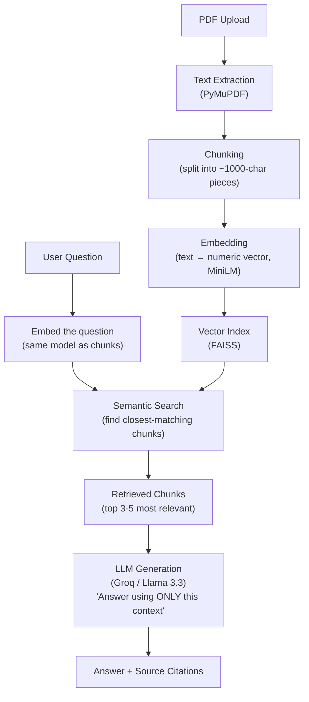

# Research Paper Intelligence Assistant

A RAG (Retrieval-Augmented Generation) system that answers questions about research papers
with verifiable source citations - built component-by-component from scratch (no LangChain)
to understand *why* each piece exists, not just *how* to call it.

**Test document:** *Spatial-Trust: A Multi-Factor Reputation Framework for Mitigating
Sybil-Attack Misinformation in Peer-to-Peer Disaster Response Systems*

---

## What it does

You give it a research paper PDF. You ask it a question in plain English. It finds the
relevant passages in the paper, and answers **only** using those passages - showing you
exactly which text it used, and refusing to answer if the paper doesn't cover it.

---

## How it works (architecture)

**In plain language:**
1. The paper is read and broken into small overlapping text pieces (chunks).
2. Each chunk is converted into a list of numbers that represents its *meaning* (an embedding) - this is what lets the system search by concept, not just exact keywords.
3. These are stored in a searchable index (FAISS).
4. When you ask a question, the question is converted the same way, and the system finds the chunks whose "meaning" is closest to your question.
5. Those chunks - and only those chunks - are handed to the LLM, with an instruction to answer strictly from that text and admit it if the answer isn't there.
6. The answer is returned alongside the exact source chunks, so every claim can be checked against the original paper.

---

## Stack

| Component | Tool |
|---|---|
| PDF text extraction | PyMuPDF |
| Chunking | Custom Python (character-based, overlapping) |
| Embeddings | Sentence-Transformers (`all-MiniLM-L6-v2`) |
| Vector search | FAISS (`IndexFlatL2`) |
| LLM generation | Groq API (Llama 3.3 70B) |

---

## Example

**Q: How does the system detect GPS-spoofing attackers?**
> The context does not contain enough information to answer how the system detects
> GPS-spoofing attackers. In fact, it explicitly states that the system cannot distinguish
> a GPS-spoofed coordinate from a genuine one using the observable feature set defined —
> which implies the system is unable to reliably detect this attack type.
>
> Sources: [Chunk 1]

The system correctly surfaced a nuanced finding *from the paper itself* (that detection
fails against this attack) rather than assuming "the paper discusses X" means "X works."

---

## Known Limitations

Found through actual testing, not anticipated in advance - documented here rather than
hidden, per the project's engineering philosophy.

- **Table extraction breaks structure.** PDF tables sometimes flatten into a single line
  of space-separated values, losing which number belongs to which column. Other tables
  extract fine with row structure intact - inconsistent depending on how the source PDF
  encodes the table.
- **Retrieval misses short, entity-dense text.** A query like *"who are the authors and
  their university affiliations"* failed to retrieve the author block, even though it
  exists on page 1 - because short lists of proper nouns embed poorly against
  natural-language questions. The system correctly said "not found," but that response is
  misleading: the information exists, retrieval just didn't surface it. This is different
  from genuine out-of-scope questions (e.g., asking about implementation details the paper
  never discusses), where "not found" is the correct and complete answer.
- **LLM self-reported citations aren't fully reliable.** The model sometimes lists a chunk
  under "Sources" that isn't actually reflected in its answer (over-citation). The
  independently-logged retrieval trail (what was mathematically retrieved) is the trustworthy
  citation source - the model's own citation claim is a nice-to-have, not authoritative.
- **Naive chunking ignores sentence boundaries.** Character-count-based splitting can cut a
  sentence or word in half at a chunk boundary. Didn't break retrieval in testing, but is a
  known fragility.

---

## What's next (System 2+)

- Hybrid search (keyword + semantic) to fix the entity-dense retrieval miss
- Reranking retrieved chunks before generation
- Query rewriting for ambiguous questions
- Structured metadata fields (authors, title) extracted separately from chunk-based search
- Citation verification (cross-checking LLM's claimed sources against actual usage)

---

## Files

- `research_paper_intelligence_assistant.ipynb` — full pipeline, step-by-step with explanations
- `spatial_trust.index` — saved FAISS index (avoids re-embedding on reload)
- `chunks.pkl` — saved text chunks matching the index
